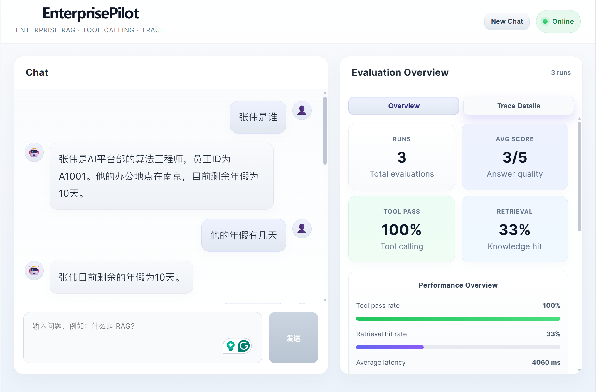
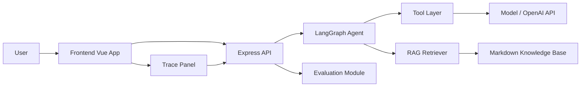

# EnterprisePilot
## 技术栈

[](https://www.typescriptlang.org/)
[](https://js.langchain.com/)
[](https://langchain-ai.github.io/langgraphjs/)
[](https://nodejs.org/)
[](https://expressjs.com/)
[](https://vuejs.org/)
[](https://vite.dev/)

**核心能力：** RAG · Tool Calling · Multi-turn Memory · Agent Trace · Evaluation · LLM-as-a-Judge

EnterprisePilot 是一个面向企业场景的多工具 AI 智能体项目，集成了大语言模型、RAG 检索增强生成、工具调用、执行 Trace 和评测能力。该项目的目标是构建一个可观测、可追踪、可扩展的企业知识助手，用于解决内部知识问答、员工信息查询、计算任务和多步工具协作等问题。
<p align="center">
  
</p>

## 项目概览

EnterprisePilot 不是一个单纯的聊天机器人，而是一个具备以下能力的企业级 Agent 平台：

- 基于企业知识库进行 RAG 检索
- 支持多种工具调用：计算、日期时间、员工查询等
- 通过 LangGraph 构建多步骤 Agent 工作流
- 记录完整执行 Trace，便于调试和解释
- 提供 Benchmark / Evaluation 模块，衡量工具调用、检索命中率、延迟和回答质量
- 支持前后端联动演示，适合企业演示或技术汇报

## 核心特性

### 1. 企业知识问答
使用 RAG 技术从企业知识库中检索与用户问题相关的信息，再由大模型生成回答，减少幻觉并提高回答准确率。

### 2. 多工具协作
系统内置多个工具：

- `rag_search`：知识库搜索
- `calculator`：数学计算
- `date_time`：查询时间
- `employee_lookup`：员工信息查询

### 3. 可观测执行链
每次请求都会记录 Agent 的决策、工具调用、工具返回结果和最终回答，用户可以在前端查看完整 Trace。

### 4. 评测框架
项目中内置了评测模块，可以对以下维度进行衡量：

- Tool Calling Accuracy
- Retrieval Hit Rate
- Latency
- Answer Quality

### 5. 前后端解耦

- 后端：Express + TypeScript + LangGraph + OpenAI-compatible API
- 前端：Vue 3 + Vite

## 技术栈

- TypeScript
- Node.js
- Express
- LangGraph
- LangChain
- OpenAI / OpenAI-compatible API
- Vue 3
- Vite

## 系统架构



## 项目结构

```text
agentflow/
├─ frontend/                     # Vue 前端
│  ├─ src/
│  ├─ package.json
│  └─ vite.config.ts
├─ src/
│  ├─ agent/
│  ├─ api/
│  ├─ data/
│  │  ├─ employees.json
│  │  └─ knowledge/
│  ├─ evaluation/
│  ├─ rag/
│  ├─ tools/
│  ├─ index.ts
│  └─ ...
├─ package.json
├─ tsconfig.json
├─ .env
├─ README.md
└─ ...
```

## 环境要求

- Node.js 18+
- npm
- OpenAI API Key 或兼容的 OpenAI-like 服务地址

## 安装步骤

### 1. 安装依赖

```bash
npm install
```

前端也需要安装依赖：

```bash
cd frontend
npm install
```

### 2. 配置环境变量
在项目根目录创建 `.env` 文件，内容示例如下：

```env
OPENAI_API_KEY=your_api_key
OPENAI_BASE_URL=https://your-provider-url/v1
```

> 如果你使用的是 OpenAI 官方接口，`OPENAI_BASE_URL` 可以留空或按官方环境配置即可。

## 运行项目

### 启动后端

```bash
npm run api
```

后端默认启动在：

```text
http://localhost:3000
```

### 启动前端

```bash
cd frontend
npm run dev
```

前端默认启动地址通常为：

```text
http://localhost:5173
```

### 构建项目

```bash
npm run build
```

## Benchmark / 评测

项目内的评测脚本位于：

- `src/evaluation/questions.json`
- `src/evaluation/evaluator.ts`
- `src/evaluation/batchEvaluate.ts`

可执行：

```bash
npx tsx src/evaluation/batchEvaluate.ts
```

该脚本会评估以下维度：

- 工具调用是否正确
- 检索是否命中关键知识
- 平均延迟
- 回答质量总体评分

## 可用的知识库来源

当前知识库采用 Markdown 文档结构，目录如下：

- `src/data/knowledge/company-overview.md`
- `src/data/knowledge/rag-guide.md`
- `src/data/knowledge/kubernetes-overview.md`
- `src/data/knowledge/employee-policy.md`
- `src/data/knowledge/agentflow-platform.md`
- `src/data/knowledge/faq.md`

这样可以更容易扩展企业知识库，并支持更稳定的 RAG 检索。

## 使用示例

在前端输入问题，例如：

- 什么是 RAG？
- Kubernetes 是什么？
- 张伟在哪个部门工作？
- 计算 123 × 456

系统会自动判断是否需要：

- 检索知识库
- 调用计算器
- 查询员工信息
- 获取时间

并在前端展示 Trace 和评测结果。

## 当前注意事项

该项目依赖真实的 LLM 服务，因此在运行真实的 Agent 任务时，需要具备有效的 OpenAI API Key 或兼容接口权限。若未配置合法凭证，模型请求可能失败。

## 未来扩展方向

- 支持更多企业工具接入
- 支持多知识库并行检索
- 支持更复杂多 Agent 任务编排
- 增加权限控制和审计日志
- 接入 Docker / Kubernetes 部署
- 增加更全面的评测面板

## 结论

EnterprisePilot 适合作为一个企业级 AI Agent 演示项目，既展示了 RAG 与工具调用的能力，也体现了可追踪、可评估和可扩展的工程实践。它非常适合用于：

- 技术演示
- 项目汇报
- 个人作品展示
- 智能体课程/实验项目

## License

本项目仅用于学习、演示和技术研究目的。
